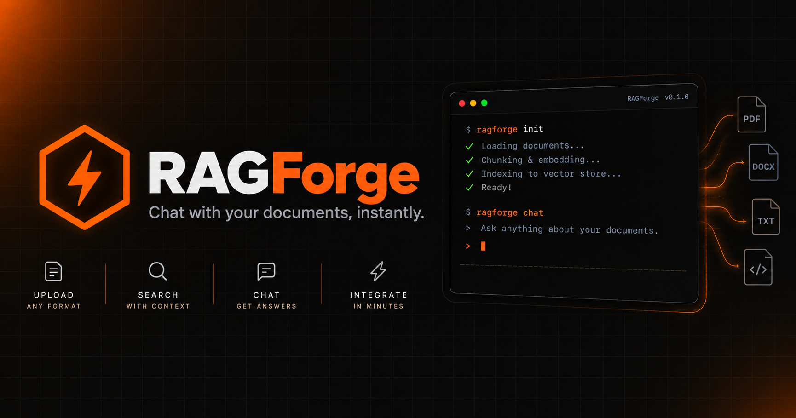

# RAGForge

Build and manage production-ready RAG (Retrieval-Augmented Generation) pipelines in minutes. Upload documents, auto-index into Neon, and chat with your data — powered by Google Gemini.

## Features

- Persistent pipelines — RAG configurations and indexed data saved to Neon, resume chat sessions anytime
- Secure authentication — full user lifecycle management via Firebase Auth, pipelines scoped to their owner
- Multi-format ingest — drag & drop support for PDF, DOCX, and TXT files
- Streaming UI — real-time responses from Gemini with token-by-token streaming and source attribution chips
- Configurable RAG — fine-tune chunk size, overlap, top-K retrieval, model selection, and system prompts
- Vector search — high-performance similarity search using Neon pgvector with 768-dimensional embeddings

## Author

**Ashutosh Swamy**

- [GitHub](https://github.com/ashutoshswamy)
- [LinkedIn](https://linkedin.com/in/ashutoshswamy)
- [X](https://x.com/ashutoshswamy_)
- [Portfolio](https://ashutoshswamy.in)

## License

MIT — see [LICENSE](LICENSE) for details.
